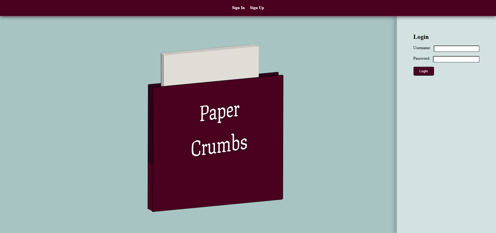

<h1>Paper Crumbs: <small>Track your favourite elements from each book you read</small></h1>

<h3>Getting Started:</h3>
<ul>
    <li><h4>Test my app here: <a href="https://paper-crumbs-6914a4d572c8.herokuapp.com/" target="_blank">Heroku | Paper Crumbs</a></h4></li>
    <li><h4>Planning materials: <a href="https://trello.com/b/zUplYZSu/proj-4-planning" target="_blank">Trello | Paper Crumbs</a></h4></li>
</ul>

<h3>Attributions:</h3>
<ul>
    <li><h4>Inspiration for the folder styling taken from <a href="https://codepen.io/INapta/pen/WNoqryL?editors=1100" target="_blank">Daiane Assen</a> | <a href="https://codepen.io/INapta" target="_blank">@INapta on CodePen</a></h4></li>
    <li><h4> <a href="https://www.pexels.com/photo/stacked-books-1333742/" target="_blank">Pexels | "Stacked Books", Suzy Hazelwood</a></h4></li>
</ul>

<h3>Technologies used:</h3>
<ul>
    <li>Python</li>
    <li>Django</li>
    <li>PostgreSQL</li>
    <li>CSS</li>
    <li>HTML</li>
</ul>

<h3>Planned future enhancements:</h3>
<ul>
    <li>Implement three more many-to-many models: Characters, Locations, Tropes</li>
    <li>Add hCaptcha to login and signup pages</li>
    <li>Implement a many-to-many relationship between the User and Book models</li>
    <li>Add functionality for Users to favourite and comment on each others' books.</li>
    <li>Implement a landing page displaying the most liked Books added by users</li>
    <li>Increased responsiveness for varied screen sizes and browsers</li>
</ul>